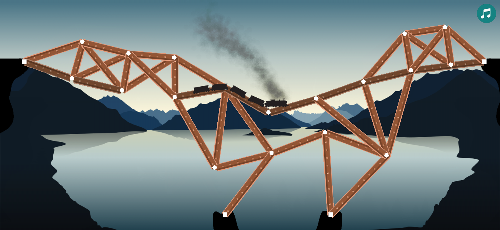

#Bridge Simulator

## Computer Graphik Praktikum SS-2018 Mainz

A small bridge simulation game written in pygame.

### Requirements

- Python 3 (Python 2 *should* also work, but you need to rebuild the levels by running "create_level.py")
  - Numpy
  - Pygame
  - Tkinter (should be in standard lib)
  - Pickle (should be in standard lib)

### Playing the game

Simply run main.py and enjoy.

The Task is to create a Bridge that does not collapse under the train.

Controls are as follows:

| Input                | Result                                       |
| -------------------- | -------------------------------------------- |
| Click                | Create a Node                                |
| Ctrl Click                | Delete a Node                                |
| Click and Drag       | Connect/Disconnect Nodes                                |
| G                    | Show/Hide Node Grid                          |
| B                    | Show/Wide Bridge Stress                      |
| Space                | Start Train (Pause)                          |
| Tab                  | Switch between Floor and support connections |
| Mouse Wheel          | Zoom                                         |
| Arrow Keys                 | Move Camera                                  |
| Ctrl +/- or p/m      | Speed up/down                                |
| Ctrl z (sometimes y) | Get back to build mode                       |
| Ctrl r               | Reset level                                  |
| Ctrl s/l             | Save/Load bridge                             |
| Ctrl 1-4             | Load level 1-4                               |

Sound can be muted by clicking the sound button (because of a pygame bug, sound is only available in windows at the moment)

Written by Jana Becker (bejana@students.uni-mainz.de) and Jan Disselhoff (jdisselh@students.uni-mainz.de)
